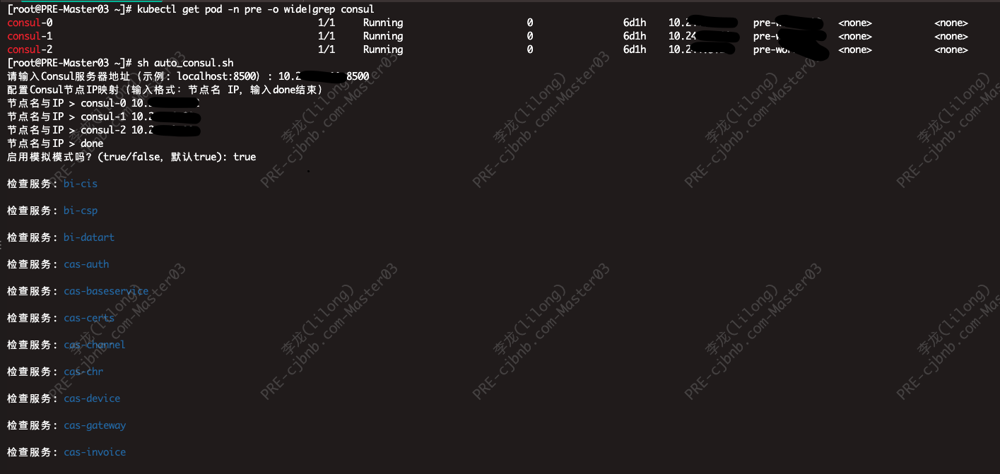

# consul-cleaner
clean service without checks in consul
# Consul 服务实例清理脚本

[](https://opensource.org/licenses/MIT)

用于自动清理 Consul 中 **没有关联健康检查** 的服务实例，适用于以下场景：
- 维护 Consul 服务注册表清洁度
- 自动移除僵尸服务实例
- 微服务架构中的常规运维
- Kubernetes 等动态环境下的实例管理

---

## ✨ 功能特性

| 功能 | 描述 |
|------|------|
| **交互式配置** | 引导式输入 Consul 地址/IP 映射 |
| **安全过滤** | 自动排除 Consul 系统服务 |
| **模拟模式** | 预演清理操作不实际执行 |
| **智能IP映射** | 自动回退节点 IP 地址 |
| **健康检查验证** | 精准匹配 Node + ServiceID |
| **彩色终端输出** | 直观的状态反馈 |
| **批量处理** | 自动遍历所有注册服务 |

---

## 🛠 前置条件

- Bash 4.0+
- `curl` 命令行工具
- `jq` JSON 处理器(yum install jq -y)
- 对 Consul 服务的访问权限
- (暂不支持) Consul ACL Token（如果启用ACL）

---

## 🚀 使用方法

### 基础使用
```bash
# 1. 授予执行权限
chmod +x consul_cleaner.sh

# 2. 交互式运行
./consul_cleaner.sh

```

举例
[](./image/example.png)

